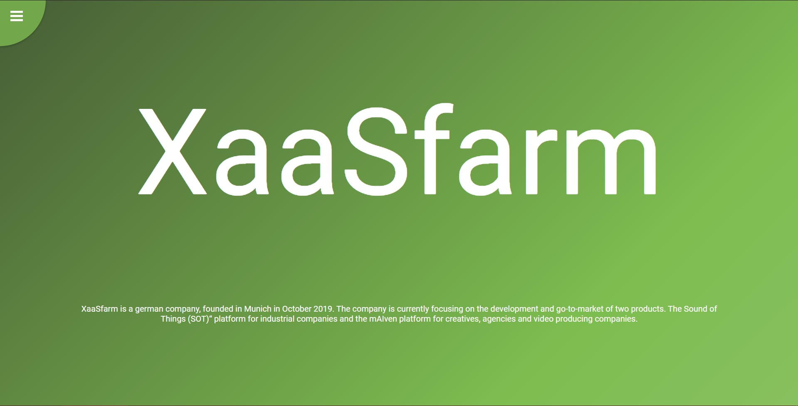
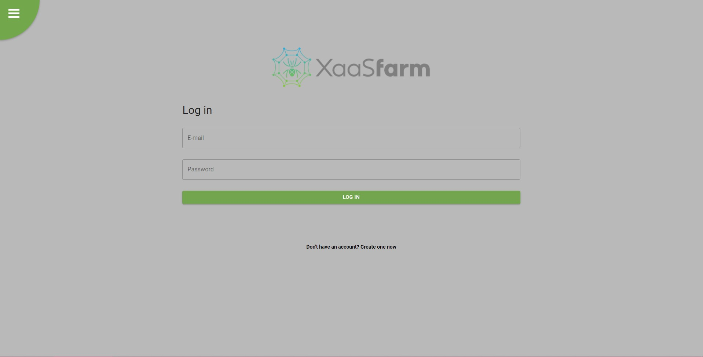
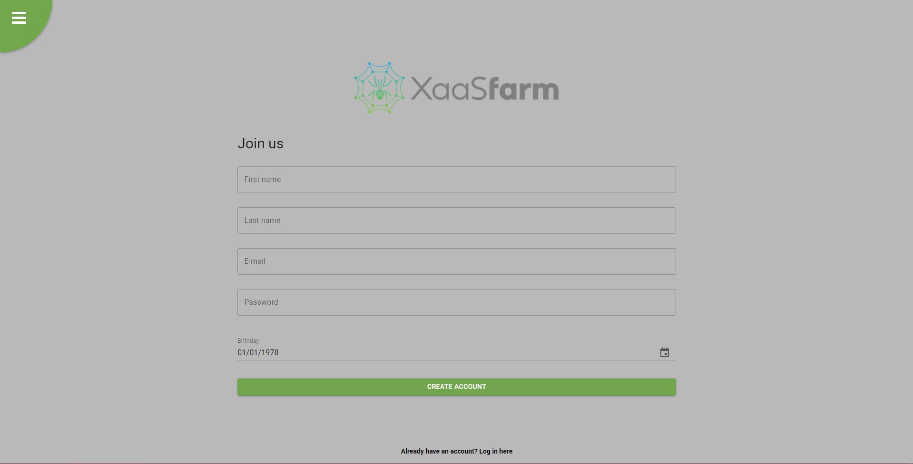
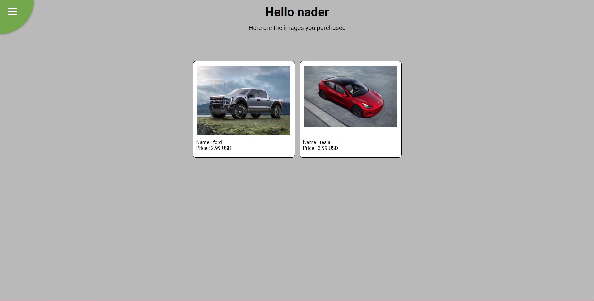
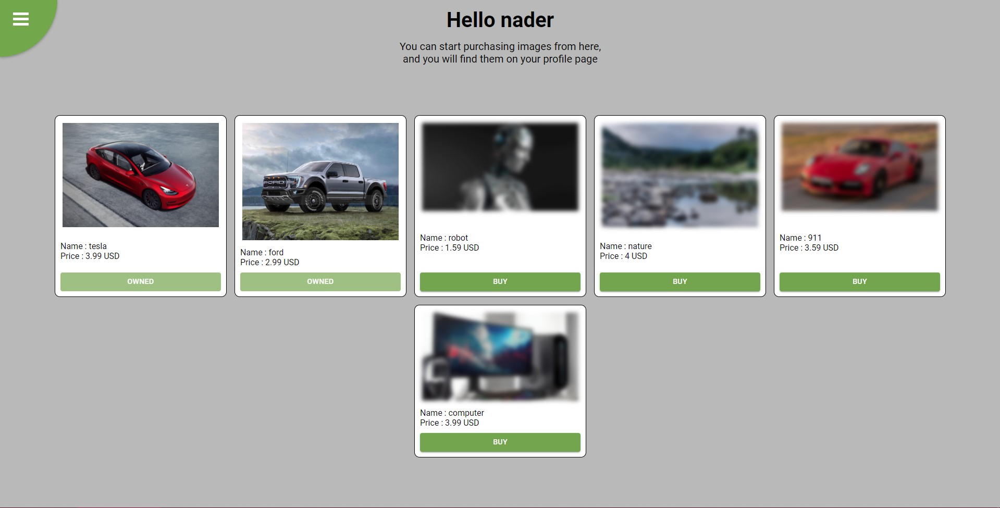

xaasfarm
the navbar is on the top left corner
you can register by entering your data in the register page in the navbar
you can log in by entering your credentials in the login page in the navbar
after logging in you can buy images from the images page in the navbar
you can check the images you purshased in the profile page

you can visit the website online at :
https://xaasfarm.herokuapp.com/

you can start the server and the backend and vscode by starting the batch file called xaasfarm.bat

home

login

register

profile

buy images

